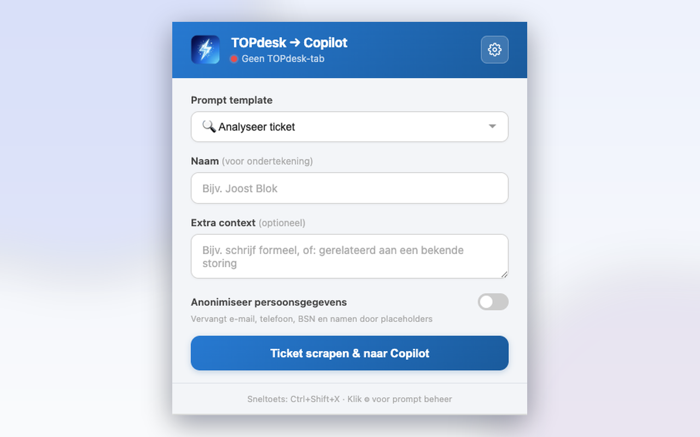
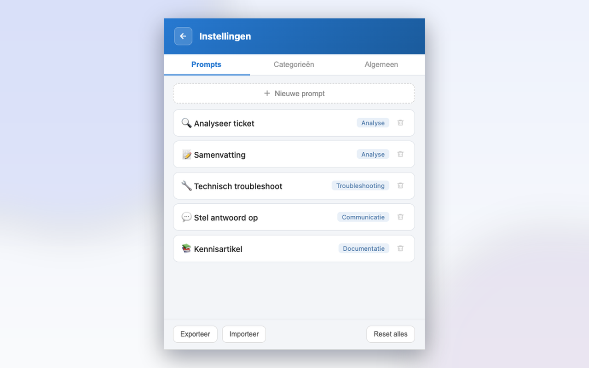

# TOPdesk → Copilot

Browserextensie (Manifest V3) die TOPdesk-tickets en bijlagen scrapet en doorstuurt naar [Microsoft 365 Copilot](https://m365.cloud.microsoft/chat/) voor analyse, troubleshooting en het opstellen van reacties. De UI en promptsjablonen zijn in het Nederlands. Werkt op Chromium-browsers (Chrome, Edge).

| Hoofdmenu | Promptbibliotheek |
|:---:|:---:|
|  |  |

---

## Voor de gebruiker

### Wat doet het?

Servicedeskmedewerkers verliezen veel tijd met het overtypen of kopiëren van ticketinformatie naar een AI-tool. Deze extensie doet dat in één klik:

1. Je opent een ticket in TOPdesk.
2. Je drukt op de sneltoets (`Ctrl+Shift+X`) of klikt op het extensie-icoon.
3. De extensie leest het ticket uit — nummer, classificatie, planning, acties en communicatie. Optioneel selecteer je bijlagen die mee moeten (screenshots, e-mails, PDF's).
4. Copilot opent in een nieuw tabblad met de prompt en alle geselecteerde bestanden al klaargezet.
5. De prompt wordt automatisch verstuurd — je hoeft niet zelf op Enter te drukken. (Uit te schakelen via ⚙ → **Algemeen**.)

### Installeren

1. Download of clone deze repository.
2. Open `chrome://extensions/` (of `edge://extensions/`) en zet **Developer mode** aan.
3. Klik **Load unpacked** en selecteer de map waar je de repository hebt gekloond/uitgepakt.
4. Pin het extensie-icoon aan de toolbar.

### Gebruik

1. Open een ticket-detailpagina in TOPdesk.
2. Klik op het extensie-icoon óf gebruik de sneltoets `Ctrl+Shift+X`.
3. Kies een promptsjabloon, vul eventueel **extra context** in, vink de gewenste bijlagen aan en klik op de scrape-knop.
4. Een nieuw tabblad opent waar prompt, ticket en bijlagen al klaarstaan.

Het **Naam**-veld in het hoofdmenu wordt als ondertekening gebruikt bij reply-prompts. De aanhef ("Beste …") wordt automatisch uit de melder-naam van het ticket gehaald.

### Bijlagen meesturen

Zodra je het extensie-icoon opent op een TOPdesk-ticket verschijnt een **Bijlagen**-sectie. Hier zie je alle bijlagen die de extensie kan vinden:

- **Geüploade bestanden** via de Bijlagen-tab van TOPdesk
- **E-mailbijlagen** (`.eml`, `.msg`, meegestuurde PDF's, etc.) van e-mailberichten in het ticket
- **Inline afbeeldingen** die in het actieveld zijn geplakt

Voor afbeeldingen ≤ 500 KB zie je een thumbnail. Voor andere bestanden een icoon op type (📄 voor PDF, ✉️ voor e-mails, 📝 voor Word, etc.).

**Slimme defaults**: bij analyse- en troubleshooting-prompts worden afbeeldingen standaard aangevinkt, bij antwoord-/afsluit-prompts niet (om te voorkomen dat je per ongeluk interne screenshots naar de klant stuurt). Je kunt altijd handmatig aan-/uitvinken, of de **Alle**/**Geen** knoppen gebruiken.

**Groottelimieten**:
- `> 10 MB` → oranje waarschuwing naast de grootte
- `> 30 MB` → rood, checkbox uitgeschakeld

Copilot accepteert een breed scala aan bestandstypen native, waaronder `.png`, `.jpg`, `.pdf`, Office-bestanden, en **`.eml` / `.msg`** — ideaal voor tickets die via e-mail binnenkomen.

**Let op**: de anonimisatie-toggle werkt alleen op tekst, niet op afbeeldingen. Een waarschuwing verschijnt automatisch als je een afbeelding aanvinkt.

### Promptsjablonen

De extensie komt met een set kant-en-klare prompts, verdeeld over de categorieën **Analyse**, **Troubleshooting**, **Communicatie** en **Documentatie**. Via het tandwiel-icoon open je de instellingenpagina waar je:

- Prompts kunt toevoegen, bewerken, verwijderen of resetten naar de standaardtekst.
- Categorieën kunt aanmaken, hernoemen of verwijderen.
- Je hele configuratie kunt **exporteren** naar een JSON-bestand of weer kunt **importeren**.
- Met **Reset alles** alles terug kunt zetten naar de bundled defaults.

Onder de tab **Algemeen** staat de optie **Prompt automatisch versturen** (standaard aan): hiermee verstuurt de extensie de prompt automatisch zodra de tekst en eventuele bijlagen in Copilot klaarstaan. Zet hem uit als je de prompt liever zelf controleert vóór verzenden.

### Sneltoets-pad

De sneltoets `Ctrl+Shift+X` gaat direct naar Copilot zonder de popup te openen, en **slaat bijlagen over** — er is geen moment om te kiezen welke mee moeten. Voor bijlagen heb je altijd de popup nodig.

---

## Voor de ontwikkelaar

### Bestandsstructuur

```
manifest.json                 Manifest V3, permissions, sneltoets, content-script matches
popup.html                    Hoofdmenu + full-page settingspagina (één HTML, twee secties)
popup.js                      Popup-logica: prompts, bijlagen-selectie, scrape-flow
background.js                 Service worker voor de sneltoets-flow
topdesk-scraper.js            Content script dat TOPdesks Mango-UI iframes uitleest
topdesk-attachments.js        On-demand content script voor bijlagen (REST API + DOM)
copilot-paste.js              Content script (isolated world) dat files uploadt
copilot-main.js               Page-script (main world) voor Lexical-editor API
default-config.json           Bundled promptsjablonen (eerste start)
icons/                        Extensie-iconen (16/48/128) + header-logo
```

### Dataflow

```
┌────────────┐  sneltoets / popup   ┌────────────────┐
│  Popup UI  │ ───────────────────▶ │  background.js │
│ popup.html │                      │ service worker │
└────────────┘                      └────────┬───────┘
        │                                    │ chrome.scripting.executeScript
        │ chrome.scripting.executeScript     ▼
        │                           ┌──────────────────┐
        ▼                           │ topdesk-scraper  │  leest Mango-UI iframes
┌──────────────────────┐            └────────┬─────────┘
│ topdesk-attachments  │                     │ ticket-tekst
│  REST + DOM + inline │                     ▼
└──────────┬───────────┘            chrome.storage.local
           │ bijlagen (dataURLs)             │  copilot_pendingTicket { text, ticketId,
           └──────────────► ─────────────────┘                          attachments[] }
                                             │
                                             ▼
                                   ┌──────────────────┐
                                   │ copilot-paste.js │  uploadt via #upload-file-button
                                   └────────┬─────────┘
                                            │ injecteert main-world script
                                            ▼
                                   ┌──────────────────┐
                                   │ copilot-main.js  │  plakt tekst via __lexicalEditor
                                   └──────────────────┘
```

### Bijlagen-detectie

De extensie combineert drie bronnen in één lijst:

| Bron | URL-patroon | Gebruikt voor |
|---|---|---|
| REST API | `/tas/api/{module}/id/{uuid}/attachments` | Via de Bijlagen-tab geüploade bestanden |
| DOM dispatcher | `/tas/secure/dispatchersecureservlet/{token}/{file}` | E-mailbijlagen en actiefeed-downloads |
| Inline images | `/services/internal-tas-proxy/.../images/image-{uuid}.jpg` | In een actie geplakte screenshots |

De UUID van het ticket wordt automatisch uit de DOM gehaald. Als meerdere UUID's worden gevonden (bv. van persoon-avatars), worden ze één voor één geprobeerd tegen meerdere TOPdesk-modules (`incidents`, `operatorChanges`, `changes`, `problems`, `serviceRequests`) totdat er één resultaat geeft. Alleen zichtbare iframes worden gescand — Mango houdt inactieve ticket-tabs anders in een verborgen container met hun eigen bijlagen.

### Copilot-injectie (two-world pattern)

Microsoft 365 Copilot gebruikt een Lexical-editor waarvan de state alleen toegankelijk is vanuit de main world van de pagina. De extensie-content-script draait in een **isolated world**. De flow is daarom tweedelig:

1. `copilot-paste.js` (isolated world):
   - Vindt `#upload-file-button` en bouwt één `DataTransfer` met alle geselecteerde bijlagen; dispatch't een `change`-event.
   - Zet de tekst in een verborgen `<div id="__topdesk_copilot_data">`.
   - Injecteert `<script src="copilot-main.js">` in de pagina.
2. `copilot-main.js` (main world):
   - Leest de tekst uit het verborgen element.
   - Gebruikt `input.__lexicalEditor.update(...)` om ParagraphNode/LineBreakNode/TextNode te plaatsen.

Bij aanwezige bijlagen zit er 400 ms tussen de file-upload en de text-injection — Copilot's React-state moet even de tijd krijgen om de upload-previews te renderen.

Na het plakken verstuurt `submitPrompt()` in `copilot-paste.js` de prompt automatisch (tenzij de gebruiker dat heeft uitgezet via `copilot_autoSubmit`). Het polt op een *actieve* verzendknop — zolang die knop uitgeschakeld is wacht het door, wat tegelijk de upload van bijlagen afwacht. Wordt er geen herkenbare verzendknop gevonden, dan valt het terug op een gesimuleerde `Enter`-toets op de editor.

Bijlagen worden als base64-dataURL opgeslagen in `chrome.storage.local` en in het paste-script omgezet naar `File`-objecten met de juiste binary bytes (`atob` + `Uint8Array`).

### Configuratie

Promptsjablonen en categorieën worden opgeslagen in `chrome.storage.local` onder `copilot_promptConfig`. De opgeslagen config is **autoritatief**: bij het laden wordt niets gemerged met de defaults, zodat toevoegingen en verwijderingen door de gebruiker behouden blijven. Alleen bij eerste gebruik (geen opgeslagen config) wordt teruggevallen op `default-config.json`.

```json
{
  "version": "2.0",
  "groups": ["Analyse", "Troubleshooting", "Communicatie", "Documentatie"],
  "promptOrder": ["analyze", "summarize", "..."],
  "prompts": {
    "analyze": { "label": "🔍 Analyseer ticket", "group": "Analyse", "text": "..." }
  }
}
```

**Storage-keys**: `copilot_pendingTicket`, `copilot_selectedPrompt`, `copilot_customPromptText`, `copilot_extraInputText`, `copilot_userName`, `copilot_anonimiseer`, `copilot_promptConfig`, `copilot_mode`, `copilot_autoSubmit`.

### Ontwikkelen

1. Open `chrome://extensions/`, zet **Developer mode** aan.
2. **Load unpacked** → selecteer deze map.
3. Na een wijziging: klik op **Reload** bij de extensie-kaart.
4. Open een TOPdesk-ticket en test via popup of sneltoets.
5. Debug-console's:
   - Popup: rechtsklik in popup → **Inspect popup**, filter op `[TOPdesk→Copilot]` of `[TOPdesk-attachments]`
   - Service worker (sneltoets): `chrome://extensions` → kaart → **service worker**
   - Paste-scripts: devtools op de Copilot-tab

### Aandachtspunten

- **Brittle scraping**: zowel `topdesk-scraper.js` als `topdesk-attachments.js` leunen op TOPdesks Mango-UI. UI-wijzigingen kunnen scraping breken. De UUID-tiers en module-fallback geven wat robuustheid, maar geen garantie.
- **Brittle plakscript**: Copilot's `#upload-file-button` en de `__lexicalEditor`-API kunnen veranderen bij Microsoft-updates. Bij problemen: inspect op de Copilot-tab.
- **10 MB storage-quota**: `chrome.storage.local` is standaard 10 MB. Base64-encoding inflateert ~33 %, dus selecties van meerdere grote bestanden kunnen het quota overschrijden. De UI blokkeert per-file > 30 MB maar telt de totale som niet.
- **Pending-timeout**: bijlagen moeten binnen 120 seconden na scrape in Copilot zijn gepland (tijd voor tab-switch + editor-load + upload). Daarna gooit het paste-script het pending-ticket weg.
- **Two-world timing**: de 400 ms delay tussen file-upload en tekst-injectie is een heuristiek. Als bij grote selecties de tekst alsnog vóór de files verschijnt, verhoog deze waarde in `copilot-paste.js` of vervang hem door een `MutationObserver` die wacht op de upload-preview-elementen.

---

## Licentie

[MIT](LICENSE).

## Privacy

Zie [PRIVACY.md](PRIVACY.md). Kort gezegd: er gaat geen data naar servers van de ontwikkelaar — ticketinhoud reist alleen tussen je TOPdesk-tab en je Copilot-tab binnen je eigen browser. Geen telemetrie, geen externe scripts.

## Disclaimer

Onafhankelijk project. Niet gelieerd aan, ondersteund door of gesponsord door TOPdesk B.V. of Microsoft Corporation. "TOPdesk" is een merk van TOPdesk B.V.; "Microsoft 365" en "Copilot" zijn merken van Microsoft Corporation.
